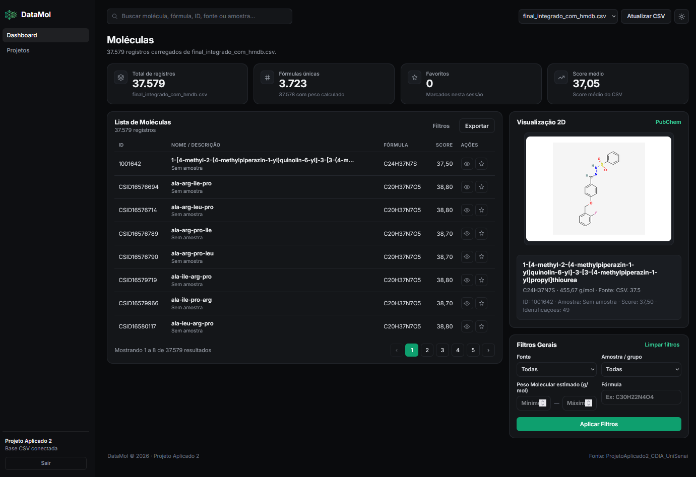
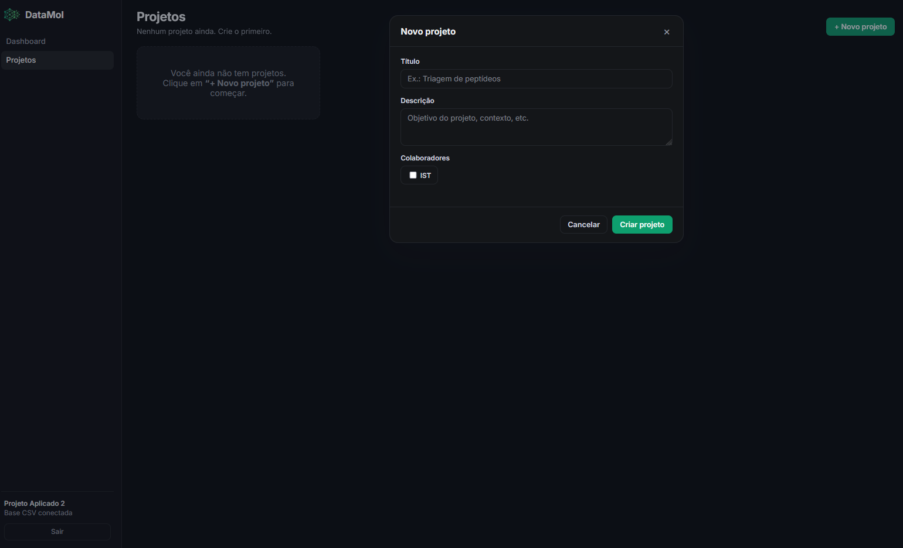

# DATAMOL
Algoritmo de predibilidade de moléculas - Projeto Aplicado II

Este repositório contém o código-fonte e a documentação do DATAMOL, uma ferramenta desenvolvida para eliminar o gargalo analítico na identificação de compostos extraídos de espectrometria de massas, integrando múltiplos bancos de dados globais num fluxo de trabalho paralelo e unificado.

## Features

- Transparência e Integridade Total dos Dados
- Manutenção de Idenficadores Originais
- Lógica de Decisão Sequencial ("A Escadinha")
- Tomada de Decisão Humana
- Projetos Simultâneos


## Funcionamento

- O pipeline executa um fluxo linear otimizado para performance:

[Planilhas Extraídas] ➔ [Filtro de Regras Locais (RegEx)] ➔ 
[Busca Paralela (Multithreading)] ➔ [Algoritmo Classificador] ➔ [CSV Final]

**Otimização por Regras Locais (RegEx)**

Antes de realizar requisições externas, a função Regras_Locais_search analisa o nome do composto usando expressões regulares

**Requisições em Paralelo (Multithreading)**

Para contornar a lentidão de chamadas sequenciais, o script utiliza concurrent.futures.ThreadPoolExecutor com um limite de 3 workers simultâneos.

**Classificação Inteligente de Natureza**

A função classificar_natureza processa as respostas das APIs e categoriza a molécula na coluna Natureza_Final através de uma árvore lógica de decisão:

Metabólito Endógeno (HMDB)\
Produto Natural\
Metabólito (Não-humano / Geral)\
Fármaco Sintético Aprovado\
Sintético em Investigação (Fase X)\
Sintético / Indefinido


## Roadmap


## Imagens





## Rodando Local

``
Python 3.8 ou superior instalado.
``

Clonar o reposítorio
```bash
  git clone https://github.com/FilipeSchweitzer/ProjetoAplicado2_CDIA_UniSenai.git
```

Entrar no repositório
```bash
  cd ProjetoAplicado2_CDIA_UniSenai
```

Instalar dependências do pipeline
```bash
  pip install -r requirements.txt
```

### Backend (PostgreSQL + API)

Instalar dependências do backend
```bash
  pip install -r criarBanco/requirements.txt
```

Criar o esquema, as funções e popular o banco a partir do CSV
```bash
  python criarBanco/create_tables.py
  python criarBanco/create_functions.py
  python criarBanco/ingest_csv.py --truncate
```

Subir a API (http://localhost:5000)
```bash
  python criarBanco/api.py
```

### Frontend (dashboard estático)

Servir o frontend por um servidor local (o fetch do CSV/API exige HTTP, não file://)
```bash
  python -m http.server 8765
```
Depois abra `http://localhost:8765/vizuPlanilhas/main.html`. No seletor de fonte
escolha o CSV ou **PostgreSQL (API)** para consumir os dados do banco.


## Documentação de viabilidade

[Documentation](https://docs.google.com/document/d/1depbNVanvJztDRn56_X1-lhH-Po8duTh2qOkjWneBdU/edit?usp=sharing)
